# 📘 Hướng dẫn sử dụng phần mềm

### 🏥 Phần mềm xếp lịch Y học Cổ Truyền & Phục Hồi Chức Năng
**Phòng khám Đa khoa Tâm Thiện Tâm**

_Tài liệu dành cho người dùng cuối • Cập nhật: 04/2026_

---

## 📑 Mục lục

1. [Giới thiệu tổng quan](#1-giới-thiệu-tổng-quan)
2. [Đăng nhập hệ thống](#2-đăng-nhập-hệ-thống)
3. [Tổng quan giao diện](#3-tổng-quan-giao-diện)
4. [Quy trình chuẩn — 7 bước xếp lịch cho 1 ngày](#4-quy-trình-chuẩn--7-bước-xếp-lịch-cho-1-ngày)
5. [Tab Thống kê — Bảng điều khiển](#5-tab-thống-kê--bảng-điều-khiển)
6. [Tab Lịch tháng — Ngày lễ & ngày nghỉ chung](#6-tab-lịch-tháng--ngày-lễ--ngày-nghỉ-chung)
7. [Tab Bác sĩ — Quản lý bác sĩ + lịch làm theo tháng](#7-tab-bác-sĩ--quản-lý-bác-sĩ--lịch-làm-theo-tháng)
8. [Tab Kỹ thuật viên (KTV)](#8-tab-kỹ-thuật-viên-ktv)
9. [Tab Máy](#9-tab-máy)
10. [Tab Thủ thuật](#10-tab-thủ-thuật)
11. [Tab Bệnh nhân](#11-tab-bệnh-nhân)
12. [Tab Kết quả & báo cáo](#12-tab-kết-quả--báo-cáo)
13. [Tab Tài khoản (chỉ Super Admin)](#13-tab-tài-khoản-chỉ-super-admin)
14. [Chế độ tối / sáng](#14-chế-độ-tối--sáng)
15. [Câu hỏi thường gặp (FAQ)](#15-câu-hỏi-thường-gặp-faq)
16. [Bảng tra cứu nhanh](#16-bảng-tra-cứu-nhanh)

---

## 1. Giới thiệu tổng quan

Phần mềm giúp phòng khám **xếp lịch tự động** các ca thủ thuật Y học Cổ truyền (YHCT) & Phục hồi chức năng (PHCN) sao cho **không trùng bác sĩ, không trùng KTV, không trùng máy** và **tuân thủ giờ làm việc + liệu trình của bệnh nhân**.

### Tính năng nổi bật

| 🎯 | Tính năng | Mô tả ngắn |
|---|---|---|
| ⚡ | **Xếp lịch tự động** | Tự tìm khung giờ khả thi cho từng ca, không cần tính tay |
| 👥 | **Nhiều tài khoản** | Super Admin tạo nhiều Admin, chia sẻ dữ liệu BS/KTV/máy chung |
| 📅 | **Lịch tháng cho từng BS/KTV** | Đặt lịch làm việc, ca sáng/chiều, ngày nghỉ theo từng người |
| 📊 | **Báo cáo trực quan** | Timeline ca, biểu đồ thời gian BS, thống kê giờ máy chạy |
| ⏱️ | **Đồng hồ đếm ngược** | Khi thực hiện ca, có timer SVG đếm ngược theo từng ca |
| 📥 | **Import Excel** | Nạp danh sách BS, KTV, máy, thủ thuật, lịch tháng từ file Excel |
| 🌙 | **Dark mode** | Chuyển sáng / tối tuỳ ý |
| 🔒 | **Bảo mật JWT** | Đăng nhập có mã hoá, phiên tự động hết hạn |

### Yêu cầu sử dụng

- Trình duyệt **Chrome, Edge, Safari, Firefox** phiên bản mới (khuyến nghị Chrome ≥ 120).
- Kết nối internet (phần mềm chạy trên web).
- Độ phân giải màn hình tối thiểu **1280 × 720**, tối ưu **1440 × 900** trở lên.

---

## 2. Đăng nhập hệ thống

Mở trình duyệt → truy cập địa chỉ do phòng khám cung cấp (ví dụ `https://lichkham.phongkham.vn/login`).

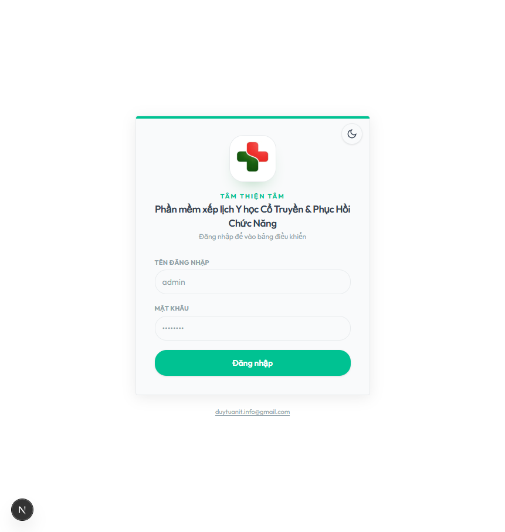

> **Chú thích**
> - 🏥 **Logo + tên phòng khám** ở trung tâm card.
> - 🔤 **Tên đăng nhập** — do Super Admin cấp (ví dụ `admin`).
> - 🔐 **Mật khẩu** — mặc định ban đầu thường là `admin123`, nên đổi ngay sau khi đăng nhập lần đầu.
> - 🌙 **Icon mặt trăng** (góc trên phải card) — chuyển sáng/tối.
> - ✅ Bấm **Đăng nhập** → vào Bảng điều khiển.

### Phân quyền

| Vai trò | Quyền | Ghi chú |
|---|---|---|
| 👑 **Super Admin** | Thấy tất cả, tạo / sửa / vô hiệu hoá tài khoản, xem tab **Tài khoản** | Chỉ có 1 — tài khoản `admin` mặc định |
| 👤 **Admin** | Xếp lịch, quản lý BS/KTV/máy/thủ thuật/bệnh nhân trong bản lịch của mình | Có thể có nhiều tài khoản Admin |

> ⚠️ **Lưu ý bảo mật:** Không chia sẻ tài khoản. Mỗi người dùng nên có tài khoản riêng để nhật ký thao tác minh bạch.

---

## 3. Tổng quan giao diện

Sau khi đăng nhập, giao diện chính gồm **3 khu vực**:

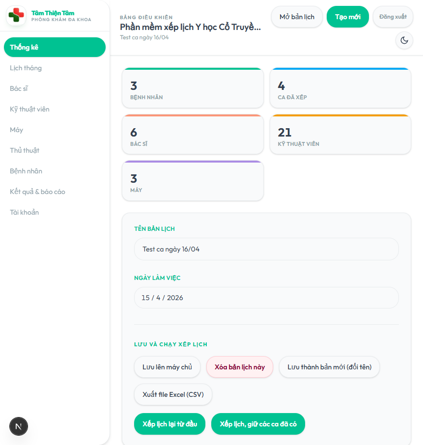

### A. Sidebar trái — Menu điều hướng (8 tab)

| Tab | Công dụng |
|---|---|
| **📊 Thống kê** | Bảng điều khiển chính: thấy số liệu, cài đặt xếp lịch, nút chạy |
| **📅 Lịch tháng** | Ngày lễ toàn hệ thống + ngày nghỉ riêng của bản lịch này |
| **👨‍⚕️ Bác sĩ** | Danh sách BS + lịch làm việc từng tháng cho mỗi BS |
| **🧑‍🔬 Kỹ thuật viên** | Danh sách KTV + lịch làm việc từng tháng cho mỗi KTV |
| **🩺 Máy** | Danh sách máy (điện châm, điện xung, siêu âm…) |
| **💉 Thủ thuật** | Danh mục dịch vụ kỹ thuật: thời lượng, BS, KTV, máy, thứ tự ưu tiên |
| **🧑 Bệnh nhân** | Danh sách bệnh nhân: liệu trình, giờ vào viện, giờ ra viện, thủ thuật đăng ký |
| **📈 Kết quả & báo cáo** | Kết quả xếp lịch + chạy ca thực tế + biểu đồ |
| **🔐 Tài khoản** | *(Chỉ Super Admin)* Quản lý user |

### B. Thanh công cụ trên (toolbar)

- **📂 Mở bản lịch** — xem tất cả bản lịch đã lưu.
- **✨ Tạo mới** — tạo bản lịch mới (trống).
- **🚪 Đăng xuất** — thoát (tự xoá cache).
- **🌓 Icon mặt trăng/mặt trời** — chuyển dark/light.

### C. Vùng nội dung chính

Thay đổi theo tab đang chọn.

---

## 4. Quy trình chuẩn — 7 bước xếp lịch cho 1 ngày

> 💡 **Thực hiện lần lượt 7 bước** dưới đây cho một ngày làm việc.

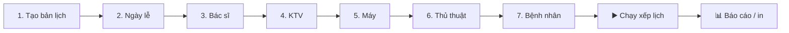
```mermaid
flowchart LR
    A[1. Tạo bản lịch] --> B[2. Ngày lễ]
    B --> C[3. Bác sĩ]
    C --> D[4. KTV]
    D --> E[5. Máy]
    E --> F[6. Thủ thuật]
    F --> G[7. Bệnh nhân]
    G --> H[▶️ Chạy xếp lịch]
    H --> I[📊 Báo cáo / in]
```

| Bước | Việc làm | Tab |
|---|---|---|
| 1 | Đặt tên bản lịch + chọn ngày làm việc | Thống kê |
| 2 | (Tuỳ chọn) Thiết lập ngày lễ + ngày nghỉ riêng | Lịch tháng |
| 3 | Nạp / chỉnh danh sách BS + lịch tháng | Bác sĩ |
| 4 | Nạp / chỉnh danh sách KTV + lịch tháng | KTV |
| 5 | Nạp / chỉnh danh sách máy | Máy |
| 6 | Nạp / chỉnh thủ thuật (BS nào, máy nào, KTV nào được làm) | Thủ thuật |
| 7 | Nhập / import bệnh nhân + chọn thủ thuật cho họ | Bệnh nhân |
| ▶️ | Bấm **Xếp lịch lại từ đầu** → xem kết quả | Thống kê / Kết quả |

> ✅ **Tip:** Các tab Bác sĩ / KTV / Máy / Thủ thuật chỉ cần thiết lập một lần rồi **dùng lại** cho các bản lịch tiếp theo.

---

## 5. Tab Thống kê — Bảng điều khiển

Đây là "trang chủ" của bản lịch đang mở.

### 5.1 Thẻ thống kê (phía trên)

| Thẻ | Ý nghĩa |
|---|---|
| 🟢 **Bệnh nhân** | Tổng số bệnh nhân đã nhập |
| 🔵 **Ca đã xếp** | Số ca thủ thuật đã sắp xếp thành công |
| 🟠 **Bác sĩ** | Tổng số BS trong bản lịch |
| 🟡 **Kỹ thuật viên** | Tổng số KTV |
| 🟣 **Máy** | Tổng số máy |

### 5.2 Tên bản lịch + ngày làm việc

- **Tên bản lịch:** gõ tên gợi nhớ, ví dụ `Lịch ngày 15/04 — ca sáng`.
- **Ngày làm việc:** là ngày mà các ca sẽ được xếp (format **dd/mm/yyyy**).

### 5.3 Khu vực "Lưu và chạy xếp lịch"

Có **6 nút** tương ứng 6 hành động:

| Nút | Chức năng |
|---|---|
| 💾 **Lưu lên máy chủ** | Lưu mọi thay đổi (tên, ngày, BS, KTV…) mà **chưa chạy xếp lịch** |
| 🗑️ **Xóa bản lịch này** | Xoá hoàn toàn bản lịch khỏi hệ thống (không khôi phục được) |
| 📋 **Lưu thành bản mới (đổi tên)** | Nhân bản sang bản lịch mới để thử nghiệm mà giữ nguyên bản gốc |
| 📤 **Xuất file Excel (CSV)** | Tải kết quả xếp lịch về máy (mở được bằng Excel) |
| ▶️ **Xếp lịch lại từ đầu** | Xoá toàn bộ ca đã xếp trước đó và xếp lại hoàn toàn mới |
| ▶️ **Xếp lịch, giữ các ca đã có** | Chỉ xếp thêm ca mới, **không đụng** các ca đã xếp trước |

### 5.4 Tuỳ chọn xếp lịch (phía dưới)

- ☑️ **Hỏi có muốn lưu bản lịch mới sau khi xếp xong** — sau khi chạy xong, sẽ có hộp thoại hỏi "lưu bản sao?" (ích lợi khi muốn thử nhiều kịch bản).
- ☑️ **Cho hai ca khác loại của cùng bác sĩ được nối liền nhau** — bật: BS không cần nghỉ giữa hai ca khác loại.
- 🔢 **Số phút nghỉ tối thiểu giữa hai ca khác loại (cùng BS)** — thường để `3` phút.

---

## 6. Tab Lịch tháng — Ngày lễ & ngày nghỉ chung

Ngày lễ / ngày nghỉ được lưu **ở 2 cấp**:

1. **Ngày lễ chung (toàn app)** — áp dụng cho mọi bản lịch; có thể bật "Lặp hàng năm" (ví dụ 30/4 hằng năm).
2. **Ngày nghỉ riêng (bản lịch này)** — chỉ áp dụng cho bản lịch đang mở.

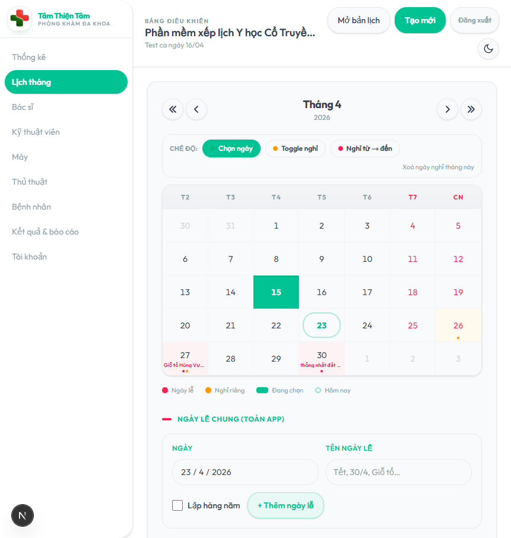

### 6.1 Lịch tháng ở trên

- Dùng nút `«` `‹` để lùi năm / lùi tháng; nút `›` `»` để tiến tháng / tiến năm.
- **3 chế độ click** (chọn ở thanh "CHẾ ĐỘ"):
  - **Chọn ngày** — chỉ chọn (không ảnh hưởng).
  - **Toggle nghỉ** — click một ngày để bật/tắt "ngày nghỉ".
  - **Nghỉ từ → đến** — click 2 ngày để đánh dấu tất cả các ngày ở giữa là nghỉ.
- Nút **Xoá ngày nghỉ tháng này** — xoá toàn bộ ngày nghỉ riêng trong tháng đang xem.

### 6.2 Chú thích màu

| 🔴 Đỏ | 🟠 Cam | 🟢 Xanh | ⚫ Vòng | 
|---|---|---|---|
| Ngày lễ | Ngày nghỉ riêng | Đang chọn | Hôm nay |

### 6.3 Thêm ngày lễ chung

- Điền **ngày**, **tên ngày lễ** (ví dụ "Giỗ tổ Hùng Vương").
- Tick **"Lặp hàng năm"** nếu ngày lễ cố định (30/4, 1/5, 2/9…).
- Bấm `+ Thêm ngày lễ`.

### 6.4 Thêm ngày nghỉ riêng

- Chọn ngày → bấm `+ Thêm ngày nghỉ`.
- Hoặc dùng chế độ **"Toggle nghỉ"** / **"Nghỉ từ → đến"** trên lịch trên.

> 💾 Cuối trang có nút **Lưu lên hệ thống** — đừng quên bấm trước khi chuyển tab.

---

## 7. Tab Bác sĩ — Quản lý bác sĩ + lịch làm theo tháng

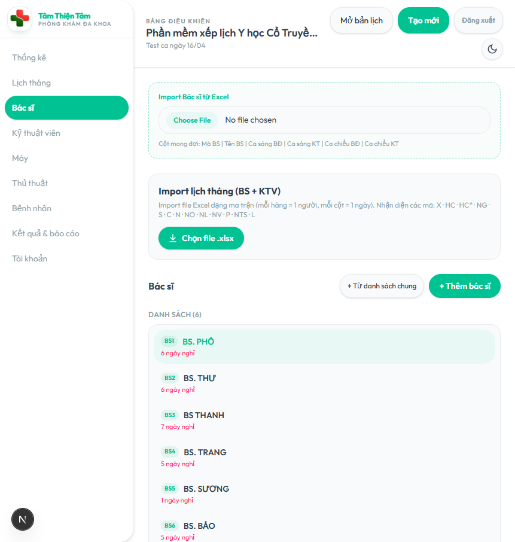

### 7.1 Import từ Excel

Có **2 loại import**:

| Loại | Cột mong đợi | Dùng khi |
|---|---|---|
| **Import Bác sĩ từ Excel** | `Mã BS \| Tên BS \| Ca sáng BĐ \| Ca sáng KT \| Ca chiều BĐ \| Ca chiều KT` | Khi có sẵn danh sách BS chuẩn |
| **Import lịch tháng (BS + KTV)** | File ma trận theo Excel mẫu của Bộ Y Tế | Khi muốn nạp lịch làm cả tháng |

**Mã ca** được nhận diện: `X · HC · HC* · NG · S · C · N · NO · NL · NV · P · NTS · L`

### 7.2 Danh sách bác sĩ

- Bấm `+ Thêm bác sĩ` để tạo trắng.
- Bấm `+ Từ danh sách chung` để chọn từ kho BS dùng chung (admin nào cũng có).
- Click 1 BS trong danh sách → hiện form chỉnh sửa bên phải.

### 7.3 Form bác sĩ + lịch tháng

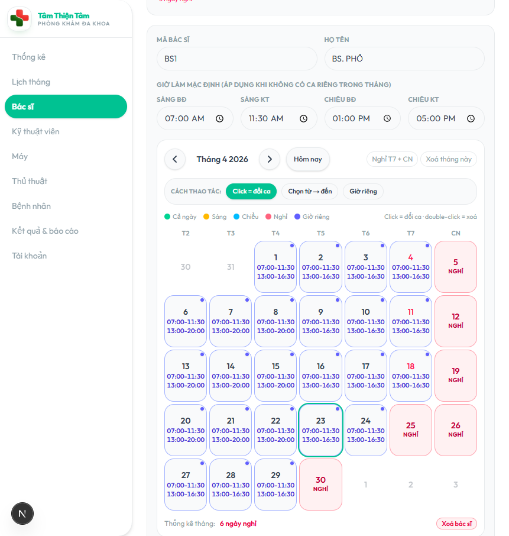

- **Mã bác sĩ:** ví dụ `BS1`, `BS2`… (dùng ngắn gọn trong bảng kết quả).
- **Họ tên:** đầy đủ, ví dụ `BS. PHỐ`.
- **Giờ làm mặc định** (áp dụng cho những ngày chưa cài riêng):
  - Ca sáng BĐ / Ca sáng KT → thường `07:00 — 11:30`
  - Ca chiều BĐ / Ca chiều KT → thường `13:00 — 17:00`

#### Lịch tháng cho BS (khối calendar lớn)

**3 chế độ click**:

1. **Click = đổi ca** → click 1 ngày để xoay vòng: `Cả ngày → Sáng → Chiều → Nghỉ → Cả ngày…`
2. **Chọn từ → đến** → click ngày bắt đầu + ngày kết thúc → áp dụng hàng loạt.
3. **Giờ riêng** → click 1 ngày → mở popup đặt giờ sáng/chiều riêng cho duy nhất ngày đó (ví dụ ngày thứ 2 trong tuần ca chiều kéo đến 20:00).

**Màu ô trong lịch**:

| 🟢 | 🟡 | 🔵 | 🔴 | 🟣 |
|---|---|---|---|---|
| Cả ngày | Sáng | Chiều | Nghỉ | Giờ riêng |

**Nút phụ**:
- **Hôm nay** — nhảy về tháng hiện tại.
- **Nghỉ T7 + CN** — tự đánh dấu nghỉ tất cả thứ Bảy + Chủ Nhật trong tháng.
- **Xoá tháng này** — xoá toàn bộ thiết lập của tháng đang xem, quay về giờ mặc định.

> 💾 Nút **Lưu lên hệ thống** ở cuối trang — bấm sau khi chỉnh xong.

---

## 8. Tab Kỹ thuật viên (KTV)

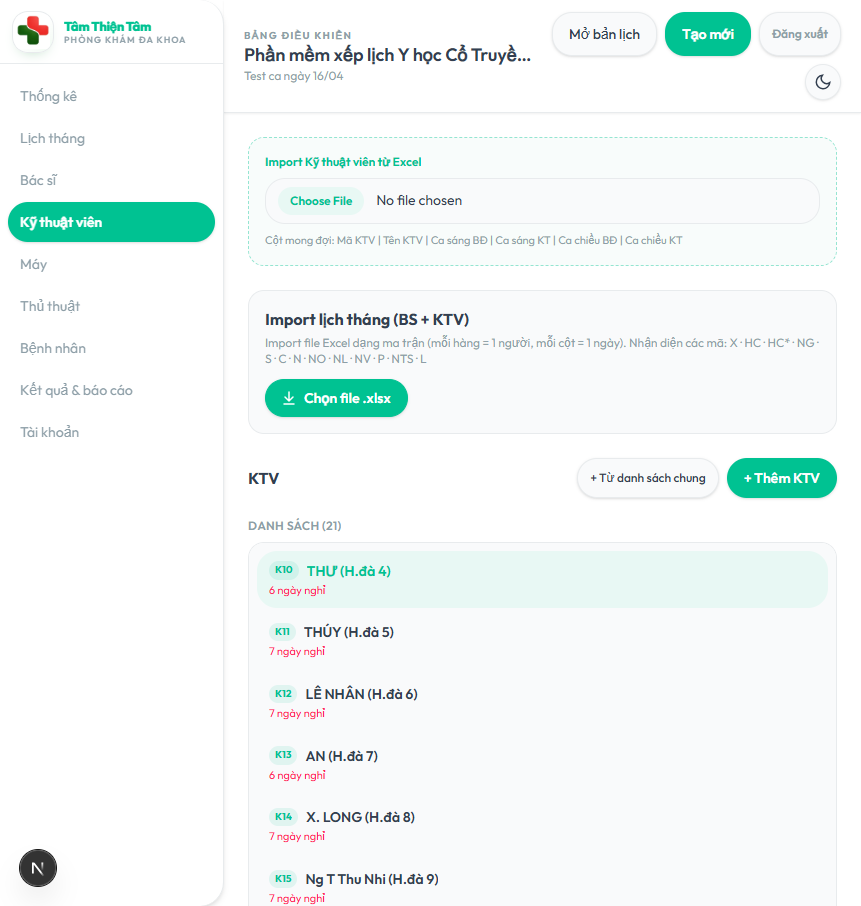

Chức năng **hoàn toàn tương tự** Tab Bác sĩ:
- Import Excel + Import lịch tháng.
- Form KTV với Mã KTV + Họ tên.
- Lịch tháng với 3 chế độ click (đổi ca / từ → đến / giờ riêng).
- Nút **Lưu lên hệ thống** ở cuối.

> 📌 **Ý nghĩa**: Engine sẽ **không xếp ca thủ thuật** trên KTV vào ngày họ nghỉ, hoặc ngoài giờ của họ.

---

## 9. Tab Máy

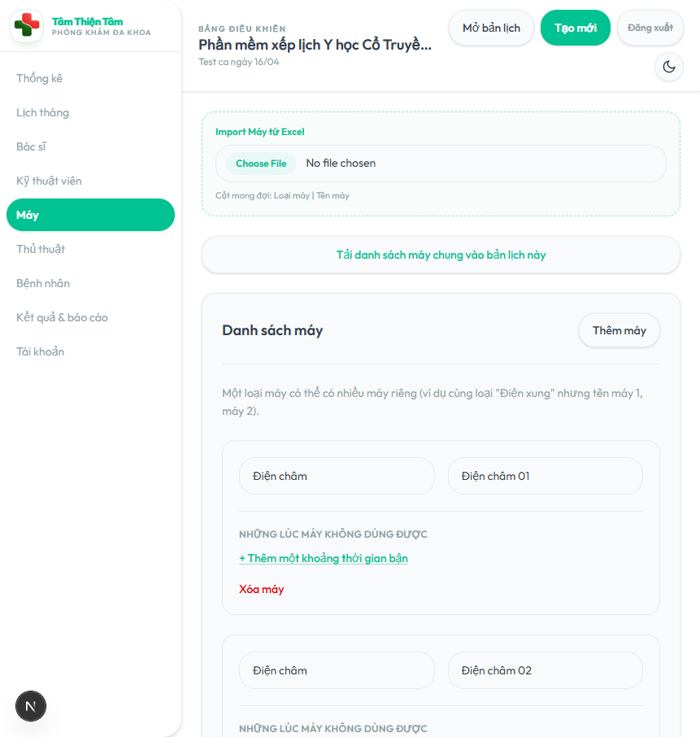

### 9.1 Import Excel

Cột mong đợi: `Loại máy | Tên máy`

### 9.2 Danh sách máy (có thể thêm thủ công)

- **Loại máy** — tên nhóm (ví dụ `Điện châm`, `Điện xung`, `Siêu âm`, `Sóng ngắn`…).
- **Tên máy** — số thứ tự riêng (`Điện châm 01`, `Điện châm 02`…).

> 💡 **1 loại có thể có nhiều máy** (ví dụ cùng loại "Điện xung" nhưng máy 1 / 2 / 3). Engine sẽ tự tìm máy rảnh.

### 9.3 "Những lúc máy không dùng được" (machine busy)

Bấm `+ Thêm một khoảng thời gian bận` → nhập giờ bắt đầu + giờ kết thúc. Dùng khi máy đang bảo trì hoặc đang phục vụ khoa khác.

### 9.4 Nút khác

- **Tải danh sách máy chung vào bản lịch này** — đem máy từ kho dùng chung.
- **Xoá máy** — xoá máy đó.

> 💾 Có nút **Lưu lên hệ thống** ở cuối trang.

---

## 10. Tab Thủ thuật

Đây là **khâu quan trọng nhất** để engine biết xếp ca thế nào.

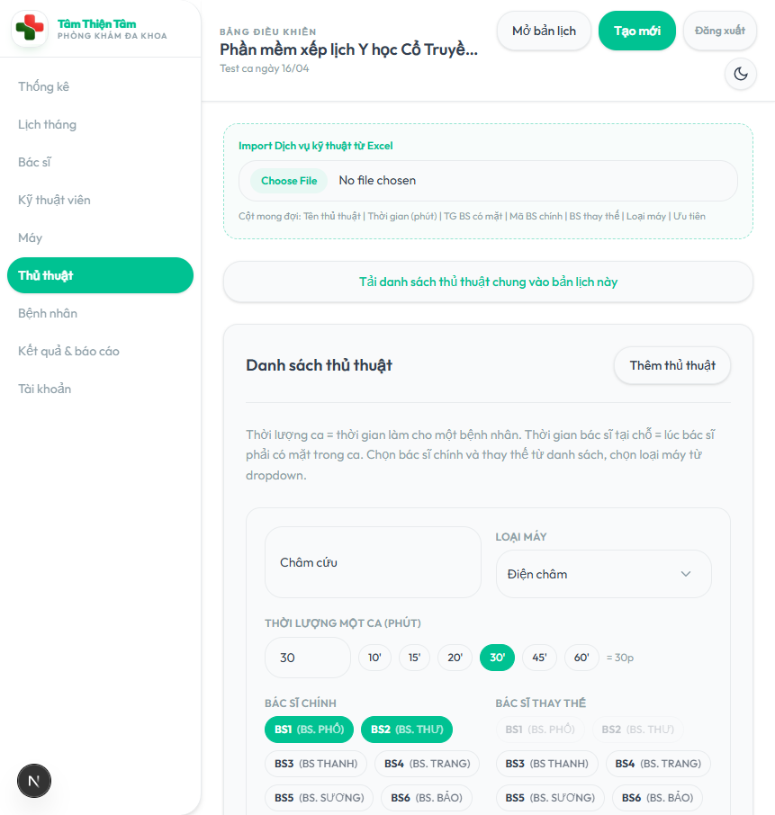

### 10.1 Import Excel

Cột: `Tên thủ thuật | Thời gian (phút) | TG BS có mặt | Mã BS chính | BS thay thế | Loại máy | Ưu tiên`

### 10.2 Form từng thủ thuật

- **Tên thủ thuật:** ví dụ `Châm cứu`, `Xoa bóp bấm huyệt`.
- **Loại máy:** dropdown — chọn từ các loại máy đã khai báo ở Tab Máy.
- **Thời lượng một ca (phút):** bấm nút nhanh `10'`, `15'`, `20'`, `30'`, `45'`, `60'` hoặc gõ số.
- **Bác sĩ chính:** tick BS được phép làm (BS có đủ chuyên môn).
- **Bác sĩ thay thế:** tick BS thay khi BS chính bận.

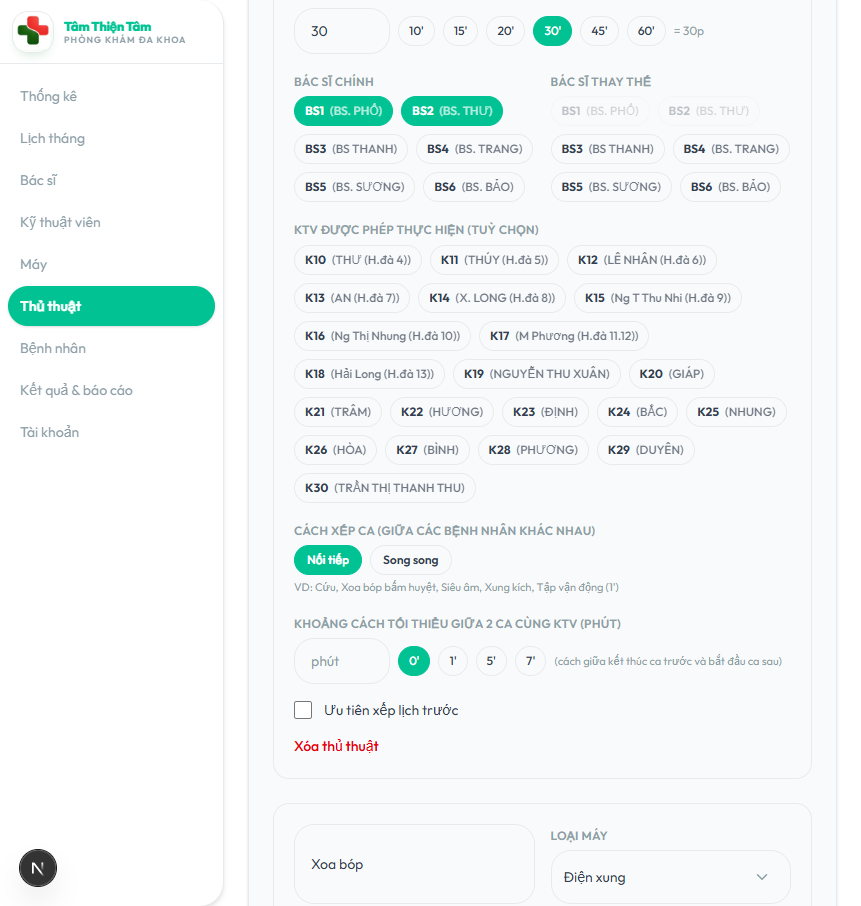

### 10.3 "KTV được phép thực hiện (tuỳ chọn)"

Tick các KTV được đảm nhận thủ thuật này. Nếu **không tick ai** → coi như BS tự làm.

### 10.4 Cách xếp ca (giữa các bệnh nhân khác nhau) ⭐

Có **2 chế độ**, rất quan trọng với YHCT và PHCN:

| Chế độ | Giải thích | Ví dụ |
|---|---|---|
| **Nối tiếp** | 2 ca không được chồng giờ — ca sau phải sau khi ca trước xong (+ gap) | Cứu, Xoa bóp, Siêu âm, Xung kích, Tập vận động → `gap 1'` |
| **Song song** | 2 ca có thể chồng giờ — chỉ cần cách nhau theo **giờ bắt đầu** | Điện châm → `gap 7'` • Điện xung / Hồng ngoại / Sóng ngắn / Kéo giãn / Xoa bóp áp lạc → `gap 5'` |

> 💡 **"Song song"** cho phép KTV cài đặt máy cho bệnh nhân A, rồi sang bệnh nhân B trong khi máy A vẫn chạy — phù hợp với những thủ thuật dùng máy có thể chạy tự động.

### 10.5 Khoảng cách tối thiểu (`gapMinutes`)

Số phút buộc cách nhau giữa **hai ca cùng KTV**:
- `0'` — không cách gì thêm.
- `1'`, `5'`, `7'` — chọn nhanh.

### 10.6 Ưu tiên xếp lịch trước

☑️ — engine sẽ ưu tiên xếp thủ thuật này **trước các thủ thuật khác**.

> 💾 Nút **Lưu lên hệ thống** ở cuối trang.

---

## 11. Tab Bệnh nhân

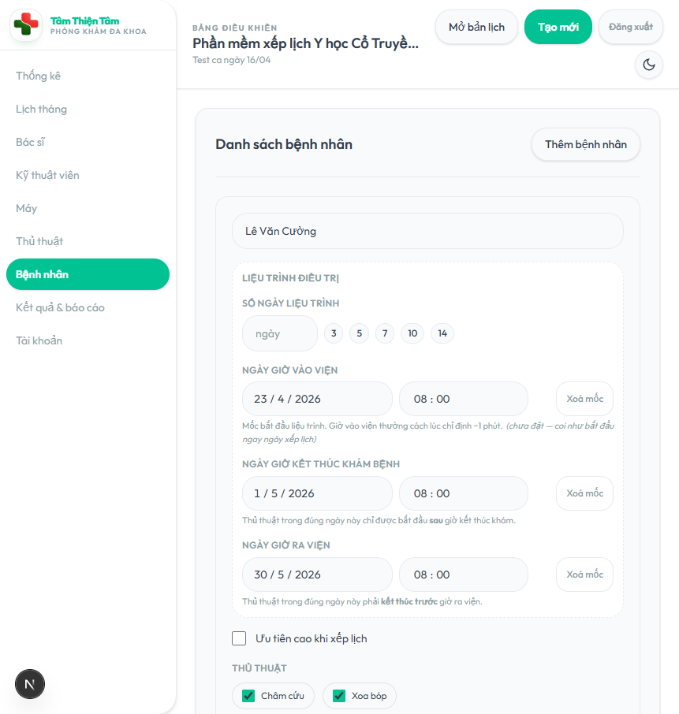

Mỗi thẻ bệnh nhân gồm:

### 11.1 Thông tin cơ bản

- **Tên hoặc mã bệnh nhân** — để phân biệt trong báo cáo.

### 11.2 Liệu trình điều trị ⭐

- **Số ngày liệu trình** — chọn nhanh `3 / 5 / 7 / 10 / 14` hoặc gõ số.
- **Ngày giờ vào viện** — mốc bắt đầu liệu trình. *(Nếu bỏ trống → coi như bắt đầu ngay ngày xếp lịch.)*
- **Ngày giờ kết thúc khám bệnh** — các thủ thuật trong **đúng ngày này** chỉ được bắt đầu **sau** giờ khám. Ví dụ khám xong lúc 10:00 thì thủ thuật phải sau 10:00.
- **Ngày giờ ra viện** — các thủ thuật trong **đúng ngày này** phải **kết thúc trước** giờ ra viện. Ví dụ ra viện lúc 15:00 thì ca cuối phải xong trước 15:00.

> 💡 Mỗi mốc có nút **"Xoá mốc"** để huỷ bỏ (không bắt buộc phải nhập đủ 3).

### 11.3 Ưu tiên cao khi xếp lịch

☑️ — Bệnh nhân VIP, bệnh nặng… engine xếp họ trước.

### 11.4 Danh sách thủ thuật đã chỉ định

Tick các thủ thuật bệnh nhân cần làm (lấy từ Tab Thủ thuật).

### 11.5 "Những lúc bệnh nhân không đến được"

Bấm `+ Thêm một khoảng thời gian bận` để đánh dấu giờ bệnh nhân bận (ví dụ có hẹn khám khác từ 9:00–9:30). Engine sẽ không xếp ca vào khoảng đó.

> 💾 Nút **Lưu lên hệ thống** ở cuối trang.

---

## 12. Tab Kết quả & báo cáo

Sau khi bấm **Xếp lịch lại từ đầu** (ở Tab Thống kê), sang tab này để xem kết quả.

Có **7 tab con** ở đầu trang:

### 12.1 Kết quả — Bảng ca đầy đủ

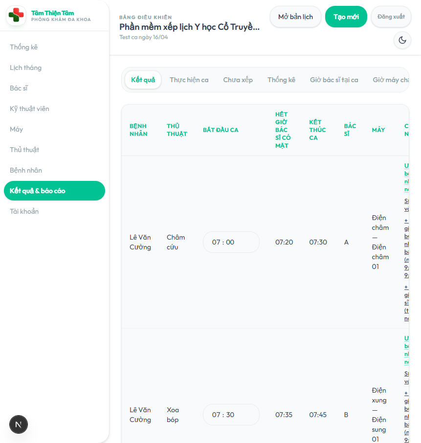

Cột bảng:
- **Bệnh nhân** • **Thủ thuật** • **Bắt đầu ca** (có thể chỉnh tay) • **Hết giờ BS có mặt** • **Kết thúc ca** • **Bác sĩ** • **Máy** • **KTV** • **Ghi chú**.
- Có thể **sửa giờ bắt đầu** từng ca trực tiếp trên bảng.
- Các nút `+ giờ bệnh nhân bận`, `+ giờ bác sĩ bận`, **Sửa giờ vào viện**, **Ưu tiên bệnh nhân này** giúp điều chỉnh nhanh.

### 12.2 Thực hiện ca — Đồng hồ đếm ngược ⭐

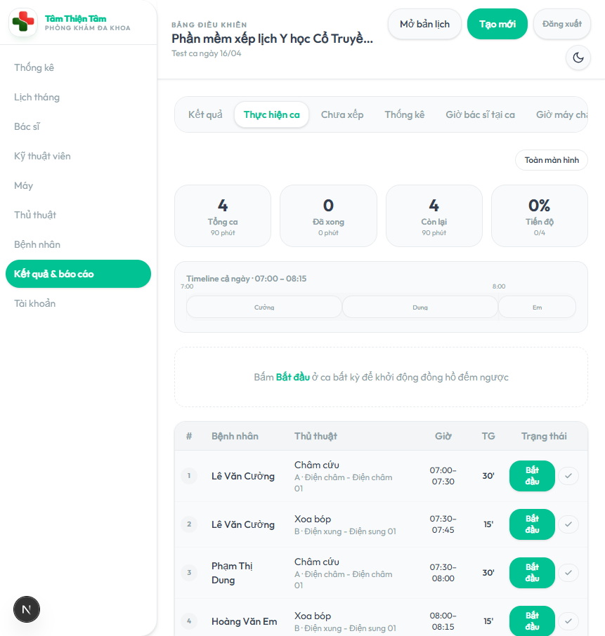

- **4 thẻ thống kê** ở trên: Tổng ca / Đã xong / Còn lại / Tiến độ (%).
- **Timeline cả ngày** ở giữa — hiển thị từng ca trên thanh ngang, có thời gian `07:00 – 08:15`.
- **Bảng ca** ở dưới với nút `Bắt đầu` và `Đánh dấu đã xong` cho mỗi ca.

Khi nhấn **Bắt đầu** ở 1 ca:

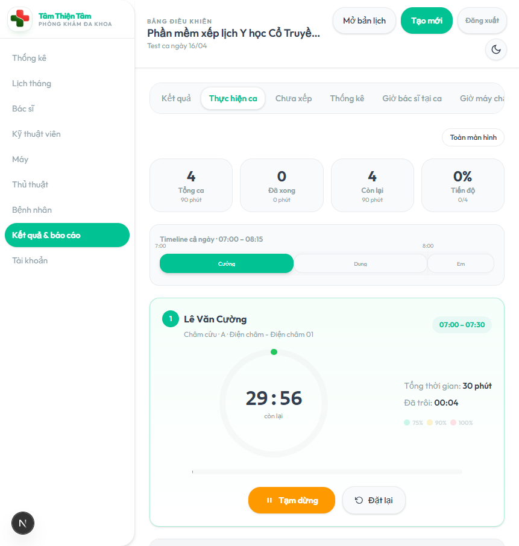

- Hiện vòng tròn SVG đếm ngược `mm : ss`.
- Bên phải: **Tổng thời gian** + **Đã trôi** + 3 mốc cảnh báo (`75%`, `90%`, `100%`).
- Thanh **tiến độ** chạy theo.
- Nút **Tạm dừng** / **Tiếp tục** / **Đặt lại**.
- Khi chạy hết thời gian → có tiếng chuông + highlight đỏ.

> 🖥️ **Toàn màn hình** — bấm để xem timer riêng (dán lên màn hình phòng chờ).

### 12.3 Chưa xếp

Liệt kê các ca **không thể xếp được** kèm **lý do cụ thể** (ví dụ "Không tìm được khung giờ thoả BS / KTV / máy / giờ làm việc", "Đã kết thúc liệu trình", "Chưa đến ngày vào liệu trình"…).

### 12.4 Thống kê

Các con số tổng (ca đã xếp, tổng phút, trung bình…).

### 12.5 Giờ bác sĩ tại ca

Tổng giờ BS phải có mặt — so sánh với tổng giờ làm để biết BS đang dư hay thiếu.

### 12.6 Giờ máy chạy

Thống kê giờ từng máy đã được dùng.

### 12.7 Biểu đồ theo bác sĩ

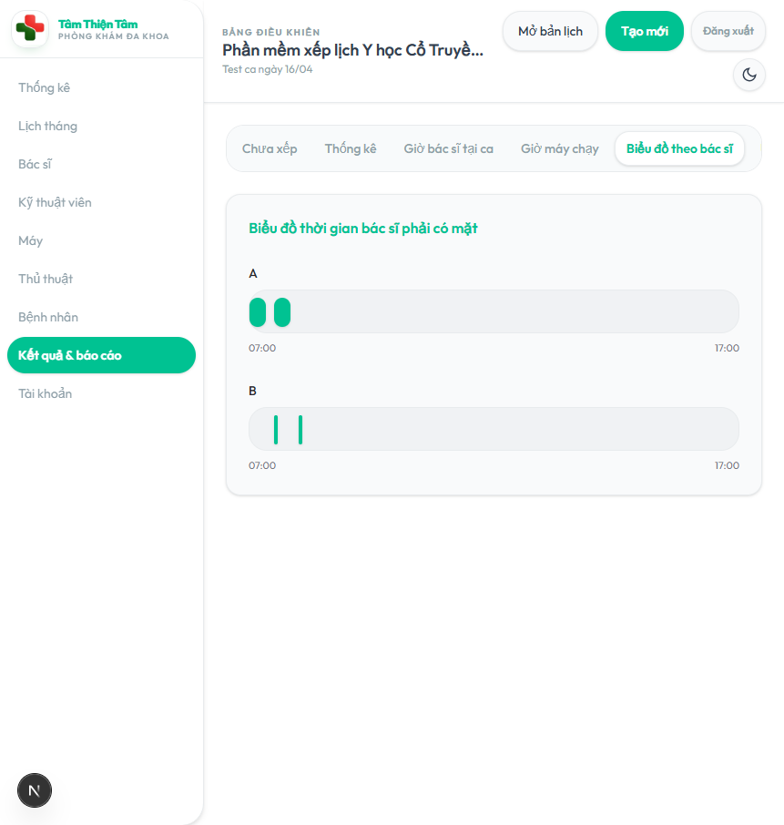

Mỗi thanh ngang là 1 bác sĩ; mỗi hộp xanh là 1 ca BS đó phải có mặt → nhìn được độ tải + khoảng trống trong ngày.

### 12.8 Ước tính còn xếp thêm được

Dự đoán: nếu thêm bệnh nhân tương tự thì còn xếp được bao nhiêu ca nữa.

---

## 13. Tab Tài khoản (chỉ Super Admin)

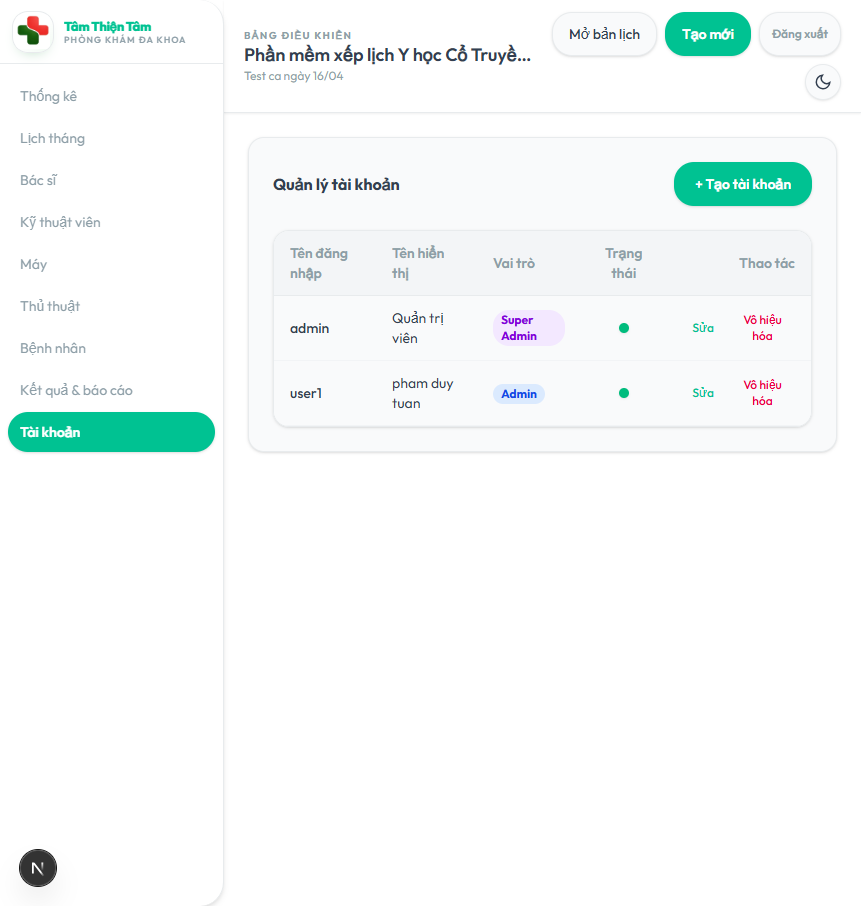

Bảng liệt kê toàn bộ tài khoản hệ thống:

| Cột | Ý nghĩa |
|---|---|
| **Tên đăng nhập** | Tài khoản login (không thay đổi được) |
| **Tên hiển thị** | Họ tên thật để xem trong UI |
| **Vai trò** | `Super Admin` (tím) • `Admin` (xanh) |
| **Trạng thái** | 🟢 Đang hoạt động • ⚫ Bị vô hiệu |
| **Thao tác** | `Sửa` — đổi mật khẩu / tên hiển thị. `Vô hiệu hoá` — khoá quyền login |

Bấm `+ Tạo tài khoản` để thêm user mới.

> ⚠️ **Chỉ Super Admin** nhìn thấy tab này và thao tác được. Admin thường sẽ không thấy tab Tài khoản ở sidebar.

---

## 14. Chế độ tối / sáng

Bấm **icon mặt trăng / mặt trời** ở góc trên phải để chuyển.

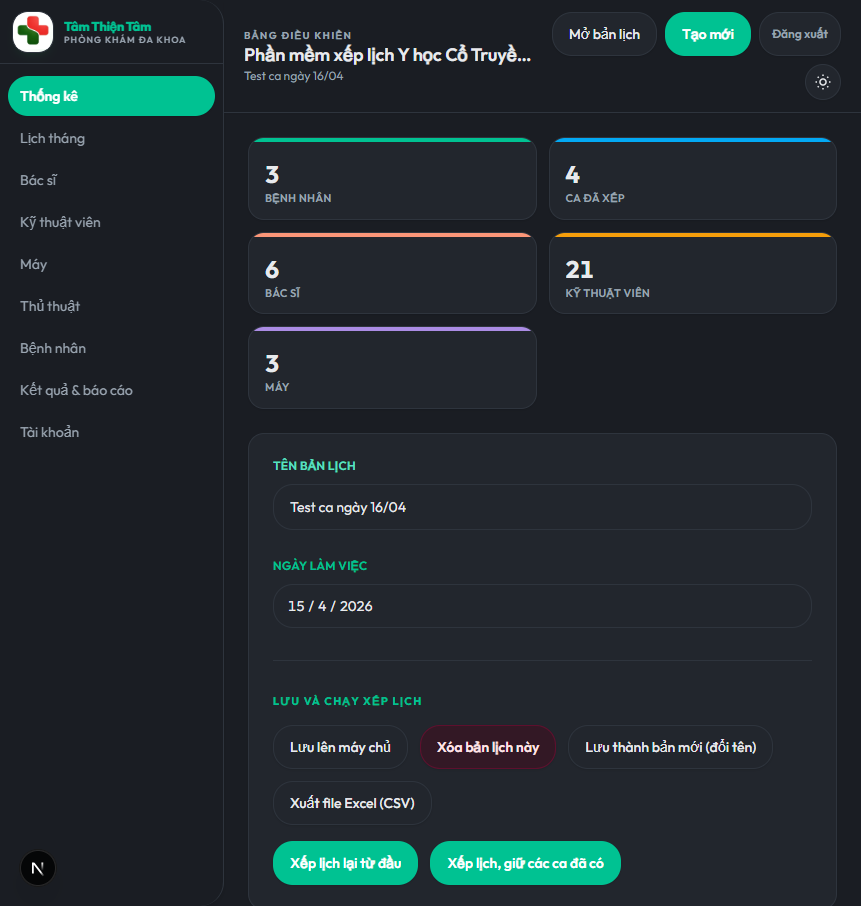

> 💡 Dark mode giảm chói mắt khi làm việc lâu, đặc biệt hữu ích cho ca đêm hoặc phòng ánh sáng yếu.

---

## 15. Câu hỏi thường gặp (FAQ)

<b>❓ Tôi bấm "Xếp lịch" mà có ca chưa xếp được thì sao?</b>

Mở tab **Kết quả & báo cáo** → click con tab **Chưa xếp**. Mỗi dòng sẽ ghi lý do, ví dụ:
- *"Không tìm được khung giờ thoả BS / KTV / máy / giờ làm việc"* → cần thêm BS / máy hoặc giãn lịch bệnh nhân.
- *"Đã kết thúc liệu trình"* → ngày xếp lịch nằm ngoài khoảng vào viện → ra viện của bệnh nhân.
- *"Thiếu thời lượng thủ thuật"* → quay lại tab Thủ thuật nhập `Thời lượng ca`.

<b>❓ Làm sao để một bản lịch dùng chung danh sách BS / KTV / máy với admin khác?</b>

Trong mỗi tab (BS / KTV / máy / thủ thuật) có nút **"+ Từ danh sách chung"** hoặc **"Tải danh sách chung vào bản lịch này"**. Danh sách chung là kho được Super Admin xây dựng ban đầu, mọi admin đều xem và nạp vào bản lịch của mình được.

<b>❓ Tôi có thể thử nhiều kịch bản mà không mất bản gốc?</b>

Dùng nút **"Lưu thành bản mới (đổi tên)"** trong Tab Thống kê. Nó sẽ nhân bản toàn bộ dữ liệu (BS / KTV / máy / thủ thuật / bệnh nhân / ca đã xếp) sang một bản mới tách biệt.

<b>❓ Dữ liệu có bị mất khi đóng trình duyệt không?</b>

Không. Mọi thứ lưu trên máy chủ ngay khi bạn bấm **"Lưu lên hệ thống"** (có ở cuối từng tab) hoặc **"Lưu lên máy chủ"** ở Tab Thống kê. Khi mở lại, phần mềm tự tải bản lịch gần nhất.

<b>❓ Quên mật khẩu thì sao?</b>

Liên hệ **Super Admin**. Super Admin vào Tab Tài khoản → `Sửa` → đặt mật khẩu mới. Bạn đăng nhập bằng mật khẩu mới và tự đổi lại.

<b>❓ Có thể xuất kết quả cho khoa / lãnh đạo xem không?</b>

Có. Tab Thống kê có nút **"Xuất file Excel (CSV)"** — tải về máy, mở bằng Excel / Google Sheets. Hoặc dùng ảnh chụp màn hình Timeline.

<b>❓ Tôi có thể điều chỉnh thủ công ca sau khi engine đã xếp không?</b>

Có. Vào tab **Kết quả & báo cáo → Kết quả**, trên bảng mỗi ca có ô **"Bắt đầu ca"** — gõ giờ mới, hệ thống sẽ kiểm tra và báo ngay nếu trùng lịch.

<b>❓ File Excel lịch tháng (ma trận) cần format thế nào?</b>

Phần mềm tự nhận diện file Excel của Bộ Y Tế với các mã:
- `X` = làm cả ngày
- `HC` / `HC*` = hành chính
- `NG` / `NL` / `NV` = nghỉ
- `S` = chỉ sáng
- `C` = chỉ chiều
- `N` / `NO` / `NTS` / `P` / `L` = nghỉ / phép / lễ

Mỗi hàng = 1 người. Mỗi cột = 1 ngày trong tháng. Phần mềm tự dò sheet đúng.

---

## 16. Bảng tra cứu nhanh

### 🎨 Ý nghĩa màu ô trong lịch tháng (BS/KTV)

| Màu | Ý nghĩa |
|---|---|
| 🟢 Xanh lá đậm | Làm cả ngày (giờ mặc định) |
| 🟡 Vàng | Chỉ ca sáng |
| 🔵 Xanh dương | Chỉ ca chiều |
| 🔴 Đỏ / hồng | Nghỉ |
| 🟣 Tím / outline | Có giờ riêng đặt custom |

### 🎨 Ý nghĩa màu ô trong Lịch tháng chung

| Màu | Ý nghĩa |
|---|---|
| 🔴 Chấm đỏ dưới số | Ngày lễ toàn hệ thống |
| 🟠 Chấm cam dưới số | Ngày nghỉ riêng |
| 🟢 Ô xanh lấp đầy | Ngày đang chọn |
| ⚪ Vòng viền ngoài | Ngày hôm nay |

### ⚙️ Quy tắc overlap thủ thuật

| Nhóm | Chế độ | `gapMinutes` |
|---|---|---|
| YHCT — Điện châm | Song song | 7 phút |
| YHCT — Cứu, Xoa bóp bấm huyệt | Nối tiếp | 1 phút |
| PHCN — Điện xung, Hồng ngoại, Sóng ngắn, Kéo giãn, Xoa bóp áp lạc hơi | Song song | 5 phút |
| PHCN — Siêu âm, Xung kích, Tập vận động | Nối tiếp | 1 phút |

### 🔐 Shortcut phím

| Phím | Công dụng |
|---|---|
| `Alt + T` | Mở thanh thông báo |
| `Enter` | Xác nhận form đang mở |
| `Esc` | Đóng dialog / popup |

---

## 📞 Hỗ trợ kỹ thuật

Nếu gặp lỗi hoặc cần hướng dẫn thêm:

📧 **Email:** <duytuanit.info@gmail.com>

🏥 **Phòng khám Đa khoa Tâm Thiện Tâm**

---

_Tài liệu này được cập nhật định kỳ. Phiên bản mới nhất luôn có trong mục `docs/HUONG-DAN-SU-DUNG.md` của phần mềm._

© 2026 TuanPham. All rights reserved.

